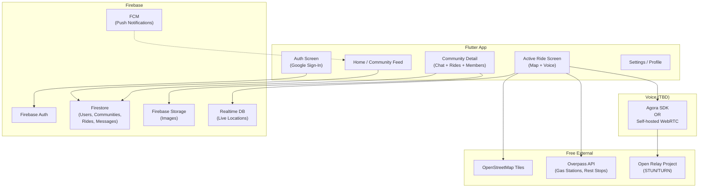
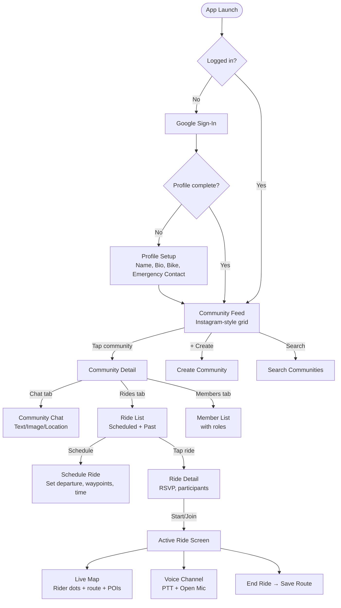

# 🏍️ MotoLink — Final Implementation Plan

All decisions are locked in based on your answers. Voice SDK choice is deferred.

---

## Confirmed Decisions Summary

| Area | Decision |
|---|---|
| **Auth** | Google Sign-In via Firebase Auth (free up to 50K MAU) |
| **Profile** | Name, photo, bio, bike (make/model/year), emergency contact |
| **Guest mode** | ❌ No — account required |
| **Backend** | **Firebase** (Firestore + Auth + Storage + FCM) |
| **State Mgmt** | **Riverpod** (modern, scalable, compile-safe) |
| **Maps** | `flutter_map` + OpenStreetMap (100% free, no API keys) |
| **Nearby POIs** | Overpass API for gas stations / rest stops (100% free) |
| **Voice** | Both PTT + Open Mic · 5-15 riders · SDK **TBD** |
| **Communities** | Public, role-based (Admin/Mod/Member), any user can create |
| **Ride scheduling** | ✅ Yes, within communities |
| **Chat** | Text + Images + Location pins (WhatsApp-style live + pin) |
| **Notifications** | Firebase Cloud Messaging (unlimited, free) |
| **Map visibility** | Same-ride riders only (future: friends) |
| **Marker info** | Dot + speed + heading |
| **Route tracking** | ✅ Yes, draw polyline |
| **Background GPS** | ✅ Yes, with reduced frequency |
| **Offline** | Cache community/chat + show last known rider positions |
| **Platform** | Android only (for now) |
| **Distribution** | Direct APK (self-hosted version check) |
| **Play Store** | Maybe later (one-time $25 fee) |
| **OTA** | Shorebird free hobby tier (for Dart-only patches) |
| **UI theme** | Keep current (black + neon green/orange) — redesign later |

---

## Free Tier Budget & Limits

> [!IMPORTANT]
> These are the hard limits that define max community size and usage patterns.

### Firebase Spark (Free) Plan

| Resource | Free Limit | Impact |
|---|---|---|
| Auth MAUs | 50,000/month | More than enough |
| Firestore Reads | 50,000/day | ~3-4 reads per user action × ~100 active users = safe |
| Firestore Writes | 20,000/day | Location updates are the biggest consumer (see below) |
| Firestore Deletes | 20,000/day | Plenty |
| Firestore Storage | 1 GiB | Chat messages + user profiles — sufficient |
| Firebase Storage | 5 GB stored, 1 GB/day download | Profile photos + chat images |
| FCM | Unlimited | ✅ |
| Simultaneous Connections | 100 | **This is the real bottleneck** |

> [!WARNING]
> **Firestore's 100 simultaneous connections and 20K writes/day are our main constraints.**
>
> **Location updates**: If 10 riders broadcast location every 5 seconds during a 2-hour ride, that's:
> `10 riders × 720 updates × 2 writes = 14,400 writes` — leaves room for chat/community ops.
>
> **Strategy**: We'll use **Firebase Realtime Database** (not Firestore) for live location tracking — it has **100K simultaneous connections** on free tier and no daily read/write limits (only 1 GB storage, 10 GB/month download). This is the standard approach.

### Firebase Realtime Database (Free) — For Location Only

| Resource | Free Limit |
|---|---|
| Simultaneous Connections | 100 |
| Storage | 1 GB |
| Download | 10 GB/month |

> [!TIP]
> **Hybrid approach**: Firestore for structured data (users, communities, chats, rides). Realtime Database for ephemeral live location streams. This is what production apps like Uber do at small scale.

### Max Community/Ride Size

Based on free tier limits:
- **Max simultaneous active riders across ALL rides**: ~80-90 (leaving headroom for other connections)
- **Max riders per single ride**: 15 (your stated preference)
- **Max communities per user**: Unlimited (it's just Firestore docs)
- **Recommended**: Cap at **50 active riders** system-wide to stay comfortably within free limits

---

## Architecture



---

## Database Schema

### Firestore Collections

```
├── users/{uid}
│   ├── displayName: string
│   ├── email: string
│   ├── photoUrl: string
│   ├── bio: string
│   ├── bike: { make: string, model: string, year: number }
│   ├── emergencyContact: { name: string, phone: string, relation: string }
│   ├── communityIds: string[]      ← quick lookup
│   ├── createdAt: timestamp
│   └── updatedAt: timestamp
│
├── communities/{communityId}
│   ├── name: string
│   ├── description: string
│   ├── photoUrl: string
│   ├── bannerUrl: string
│   ├── location: string            ← e.g., "Pune, Maharashtra"
│   ├── bikeType: string            ← e.g., "All", "Sportbikes", "Cruisers"
│   ├── createdBy: string (uid)
│   ├── memberCount: number
│   ├── createdAt: timestamp
│   │
│   ├── /members/{uid}              ← subcollection
│   │   ├── role: "admin" | "moderator" | "member"
│   │   ├── displayName: string     ← denormalized for quick display
│   │   ├── photoUrl: string
│   │   └── joinedAt: timestamp
│   │
│   ├── /messages/{messageId}       ← subcollection
│   │   ├── senderId: string
│   │   ├── senderName: string      ← denormalized
│   │   ├── type: "text" | "image" | "location"
│   │   ├── content: string         ← text or image URL
│   │   ├── location: { lat, lng, address, label }  ← if type=location
│   │   └── timestamp: timestamp
│   │
│   └── /rides/{rideId}             ← subcollection
│       ├── title: string
│       ├── description: string
│       ├── departureLocation: { lat, lng, address }
│       ├── departureTime: timestamp
│       ├── waypoints: [{ lat, lng, address, label }]
│       ├── status: "scheduled" | "active" | "completed"
│       ├── createdBy: string (uid)
│       ├── maxRiders: number (default 15)
│       ├── rsvpCount: number
│       ├── createdAt: timestamp
│       │
│       └── /participants/{uid}     ← subcollection
│           ├── status: "rsvp" | "active" | "left"
│           ├── displayName: string
│           └── joinedAt: timestamp
```

### Firebase Realtime Database (Live Location — Ephemeral)

```json
{
  "rides": {
    "{rideId}": {
      "{uid}": {
        "lat": 18.5204,
        "lng": 73.8567,
        "speed": 65.5,
        "heading": 315.0,
        "timestamp": 1717070400000
      }
    }
  }
}
```

> [!NOTE]
> Location data in Realtime DB is **ephemeral** — deleted when ride ends. Route history (polyline coordinates) is saved to Firestore under the ride document when ride completes.

---

## Project Structure

```
lib/
├── main.dart                       ← Entry point
├── app/
│   ├── app.dart                    ← MaterialApp + ProviderScope
│   └── router.dart                 ← GoRouter navigation
│
├── config/
│   ├── theme.dart                  ← Current dark theme (keep as-is)
│   └── constants.dart              ← API URLs, limits, keys
│
├── features/
│   ├── auth/
│   │   ├── data/
│   │   │   └── auth_repository.dart
│   │   ├── domain/
│   │   │   └── user_model.dart
│   │   └── presentation/
│   │       ├── login_page.dart
│   │       └── profile_setup_page.dart
│   │
│   ├── community/
│   │   ├── data/
│   │   │   └── community_repository.dart
│   │   ├── domain/
│   │   │   ├── community_model.dart
│   │   │   └── member_model.dart
│   │   └── presentation/
│   │       ├── community_feed_page.dart      ← "Instagram-like" grid/list
│   │       ├── community_detail_page.dart    ← Tabs: Chat | Rides | Members
│   │       ├── create_community_page.dart
│   │       └── widgets/
│   │           ├── community_card.dart
│   │           └── member_tile.dart
│   │
│   ├── chat/
│   │   ├── data/
│   │   │   └── chat_repository.dart
│   │   ├── domain/
│   │   │   └── message_model.dart
│   │   └── presentation/
│   │       ├── chat_page.dart
│   │       └── widgets/
│   │           ├── message_bubble.dart
│   │           ├── location_pin_card.dart
│   │           └── image_message.dart
│   │
│   ├── ride/
│   │   ├── data/
│   │   │   └── ride_repository.dart
│   │   ├── domain/
│   │   │   ├── ride_model.dart
│   │   │   └── participant_model.dart
│   │   └── presentation/
│   │       ├── schedule_ride_page.dart
│   │       ├── ride_detail_page.dart
│   │       └── widgets/
│   │           └── ride_card.dart
│   │
│   ├── map/
│   │   ├── data/
│   │   │   ├── location_repository.dart      ← Realtime DB read/write
│   │   │   └── overpass_repository.dart       ← Gas stations, rest stops
│   │   ├── domain/
│   │   │   ├── rider_location_model.dart
│   │   │   └── poi_model.dart
│   │   └── presentation/
│   │       ├── live_map_page.dart             ← The main ride map
│   │       └── widgets/
│   │           ├── rider_marker.dart
│   │           ├── poi_marker.dart
│   │           └── route_polyline.dart
│   │
│   ├── voice/
│   │   ├── data/
│   │   │   └── voice_service.dart            ← TBD: Agora or WebRTC
│   │   └── presentation/
│   │       ├── voice_overlay.dart            ← Floating PTT/mic controls
│   │       └── widgets/
│   │           ├── ptt_button.dart
│   │           └── speaker_indicator.dart
│   │
│   └── settings/
│       └── presentation/
│           ├── settings_page.dart
│           └── edit_profile_page.dart
│
├── shared/
│   ├── providers/                            ← Riverpod providers
│   │   ├── auth_provider.dart
│   │   ├── community_provider.dart
│   │   ├── ride_provider.dart
│   │   ├── location_provider.dart
│   │   └── chat_provider.dart
│   ├── services/
│   │   ├── firebase_service.dart
│   │   ├── location_service.dart             ← GPS + background tracking
│   │   ├── notification_service.dart         ← FCM setup
│   │   └── update_service.dart               ← APK version check
│   ├── widgets/
│   │   ├── navbar.dart                       ← Updated bottom nav
│   │   ├── loading_overlay.dart
│   │   └── error_widget.dart
│   └── utils/
│       ├── helpers.dart
│       └── validators.dart
```

---

## Role-Based Permissions

| Action | Admin | Moderator | Member |
|---|---|---|---|
| Edit community info | ✅ | ❌ | ❌ |
| Delete community | ✅ | ❌ | ❌ |
| Promote/demote members | ✅ | ❌ | ❌ |
| Remove members | ✅ | ✅ | ❌ |
| Mute members in voice | ✅ | ✅ | ❌ |
| Delete chat messages | ✅ | ✅ | ❌ |
| Schedule rides | ✅ | ✅ | ✅ |
| Send messages | ✅ | ✅ | ✅ |
| Join/leave rides | ✅ | ✅ | ✅ |
| Share locations | ✅ | ✅ | ✅ |

> Community creator is automatically **Admin**. Admins can promote members to Moderator.

---

## App Flow



---

## Proposed Changes — Phase by Phase

### Phase 1 — Project Foundation & Auth *(~3-4 days)*

Set up the project skeleton, Firebase integration, and authentication flow.

#### [MODIFY] [pubspec.yaml](file:///home/kevinpatil/Desktop/Kevin/moto-link-app/pubspec.yaml)
- Add all required dependencies: `firebase_core`, `firebase_auth`, `cloud_firestore`, `firebase_database`, `firebase_storage`, `firebase_messaging`, `google_sign_in`, `flutter_riverpod`, `go_router`, `flutter_map`, `geolocator`, `latlong2`, `image_picker`, `cached_network_image`, `http`, etc.

#### [MODIFY] [main.dart](file:///home/kevinpatil/Desktop/Kevin/moto-link-app/lib/main.dart)
- Wrap app in `ProviderScope` for Riverpod
- Initialize Firebase
- Set up `GoRouter` for navigation
- Auth-gated routing (login vs home)

#### [NEW] `lib/app/router.dart`
- Define all routes with GoRouter
- Auth redirect logic

#### [NEW] `lib/features/auth/` (3 files)
- `auth_repository.dart` — Google Sign-In + Firebase Auth logic
- `user_model.dart` — User data class
- `login_page.dart` — Google Sign-In button screen
- `profile_setup_page.dart` — First-time profile form (name, bio, bike, emergency contact)

#### [NEW] `lib/shared/providers/auth_provider.dart`
- Riverpod providers for auth state, current user

---

### Phase 2 — Communities *(~4-5 days)*

The "Instagram-like" community feed, create/join/manage communities.

#### [NEW] `lib/features/community/` (6+ files)
- `community_model.dart` — Community + Member data classes
- `community_repository.dart` — CRUD operations on Firestore
- `community_feed_page.dart` — Grid/card view of all communities (searchable)
- `community_detail_page.dart` — Tabbed view (Chat | Rides | Members)
- `create_community_page.dart` — Form: name, description, photo, location, bike type
- `member_tile.dart` — Shows member with role badge

#### [MODIFY] [navbar.dart](file:///home/kevinpatil/Desktop/Kevin/moto-link-app/lib/widgets/navbar.dart)
- Update tabs: **Communities | Map | Voice | Settings** (or similar)

---

### Phase 3 — Community Chat *(~3-4 days)*

Text, image, and location sharing within community chats.

#### [NEW] `lib/features/chat/` (5+ files)
- `message_model.dart` — Text/Image/Location message types
- `chat_repository.dart` — Firestore messages subcollection
- `chat_page.dart` — Chat UI with message list + input bar
- `message_bubble.dart` — Renders text/image/location differently
- `location_pin_card.dart` — Tappable location card (opens on map)

Location sharing: WhatsApp-style. User taps 📎 → "Share Location" → picks current location or drops a pin → sends as a message with map preview.

---

### Phase 4 — Ride Scheduling & Management *(~3-4 days)*

Schedule rides within communities, RSVP, start/end rides.

#### [NEW] `lib/features/ride/` (5+ files)
- `ride_model.dart` + `participant_model.dart`
- `ride_repository.dart` — Create/RSVP/start/end rides
- `schedule_ride_page.dart` — Form: title, departure location (map picker), time, waypoints
- `ride_detail_page.dart` — Shows participants, RSVP status, start button
- `ride_card.dart` — Compact ride preview for lists

---

### Phase 5 — Live Map & Location Tracking *(~5-6 days)*

The core ride experience — real-time map with rider positions.

#### [NEW] `lib/features/map/` (6+ files)
- `location_repository.dart` — Read/write to Firebase Realtime DB
- `overpass_repository.dart` — Query gas stations / rest stops from OSM
- `rider_location_model.dart` + `poi_model.dart`
- `live_map_page.dart` — flutter_map with OSM tiles, rider markers, route polyline, POI markers
- `rider_marker.dart` — Custom marker showing dot + name + speed + heading arrow
- `route_polyline.dart` — Draws the path as rider moves

#### [NEW] `lib/shared/services/location_service.dart`
- GPS stream via `geolocator`
- Background tracking with reduced frequency (foreground: 3s, background: 10s)
- Write location to Realtime DB
- Android foreground service notification ("MotoLink is tracking your ride")

---

### Phase 6 — Voice Communication *(~5-7 days, depends on SDK choice)*

> [!IMPORTANT]
> **This phase is blocked until you decide: Agora (easy, 10K min/month free) vs self-hosted WebRTC (unlimited, complex).**
> We can build everything else first and add voice last.

#### [NEW] `lib/features/voice/` (3+ files)
- `voice_service.dart` — Abstracted interface (swap SDK later)
- `voice_overlay.dart` — Floating controls during active ride
- `ptt_button.dart` — Hold-to-talk button
- `speaker_indicator.dart` — Shows who's talking

---

### Phase 7 — Polish & Distribution *(~3-4 days)*

#### [NEW] `lib/shared/services/update_service.dart`
- On app launch, check a JSON file hosted on GitHub/Firebase for latest version
- If newer version available, show dialog with download link to APK
- APK hosted on GitHub Releases (free, unlimited)

#### [NEW] `lib/shared/services/notification_service.dart`
- FCM token registration
- Handle notification taps (navigate to correct community/ride)

#### [MODIFY] Settings page — connect to real user data
#### [MODIFY] Guardian page — connect to real sensors (accelerometer, battery)

---

## Verification Plan

### Automated / Dev Testing
- `flutter analyze` — Zero warnings
- `flutter build apk --release` — Successful build
- Test auth flow on physical Android device
- Test location tracking with real GPS (ride simulation)
- Test chat with 2+ devices
- Test ride flow end-to-end: schedule → RSVP → start → track → end

### Manual Verification
- Install APK on 2-3 Android phones
- Create community, join from another device
- Schedule ride, RSVP from other device, start ride
- Verify live map shows both riders moving
- Verify chat messages sync in real-time
- Verify push notifications arrive when app is closed
- Test background location tracking (lock phone, check if location updates continue)

---

## Open Decisions (Decide Later)

| Decision | Options | When to Decide |
|---|---|---|
| Voice SDK | Agora (easy) vs WebRTC (unlimited) | Before Phase 6 |
| Play Store | $25 one-time fee | When ready to publish |
| iOS support | Requires Mac + $99/year Apple Dev | Future |
| Shorebird OTA | Free hobby tier | After first APK release |

---

## Dependencies to Install

```yaml
dependencies:
  flutter:
    sdk: flutter
  
  # Firebase
  firebase_core: ^3.13.0
  firebase_auth: ^5.5.0
  cloud_firestore: ^5.6.0
  firebase_database: ^11.3.0
  firebase_storage: ^12.4.0
  firebase_messaging: ^15.2.0
  google_sign_in: ^6.2.2
  
  # State Management
  flutter_riverpod: ^2.6.1
  
  # Navigation
  go_router: ^14.8.1
  
  # Maps & Location
  flutter_map: ^8.3.0
  geolocator: ^14.0.2
  latlong2: ^0.9.1
  
  # UI
  google_fonts: ^6.1.0
  flutter_animate: ^4.2.0
  cupertino_icons: ^1.0.2
  cached_network_image: ^3.4.1
  image_picker: ^1.1.2
  
  # Utils
  http: ^1.3.0
  intl: ^0.19.0
  uuid: ^4.5.1
  shared_preferences: ^2.3.4
  permission_handler: ^11.3.1
```

> [!NOTE]
> Exact versions will be validated against the latest pub.dev at implementation time.
